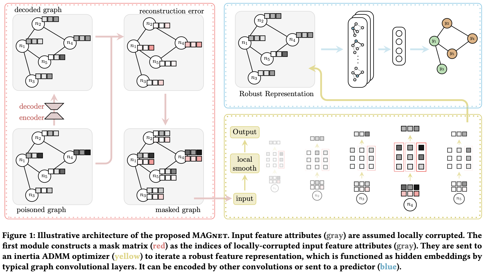

# MAGnet

This repository is the official implementation of [Robust Graph Representation Learning for Local Corruption Recovery](https://download.arxiv.org/pdf/2202.04936v3.pdf).



## Requirements

To install requirements:

```
pip3 install -r requirements.txt
```

## Folder-generate_noisedata 
The folder generate_noisedata contains two types of noise, i.e. injecttion noise and noise by mettack. 
Also, the gae_run.py runs graph auto encoder to find the noisy item after the nosie generated on the feature matrix.

## Folder-denoise
Run the main_denoise.py will use the regularized optimization method to denoise the local corrupted featue matrix.

## Folder-class
Run the graph_class.py will test the performance on the denoised dataset.

## All Experiments
To reproduce the results in the paper, you can use the following command

```
python main.py 
```
The key arguments are: --dataset, --filter_type, --attack, and --GConv_type. For example, if you would like to reproduce the result for DoT with GCN on Cora in Table 1, you can run the following command

```
python main.py --dataset Cora --filter_type DoT --attack Mix --GConv_type GCN
```
Other tunable hyperparameters include: --lr, --wd, --nhid, --dropout, --admm_iter, --rho, --lam, etc.


## Citation 
If you consider our codes and datasets useful, please cite:
```
@inproceedings{zhou2022robust,
  title={Robust graph representation learning for local corruption recovery},
  author={Zhou, Bingxin and Jiang, Yuanhong and Wang, Yu Guang and Liang, Jingwei and Gao, Junbin and Pan, Shirui and Zhang, Xiaoqun},
  booktitle={The Web Conference},
  dio={https://doi.org/10.1145/3543507.3583399}
  year={2023}
}
```
